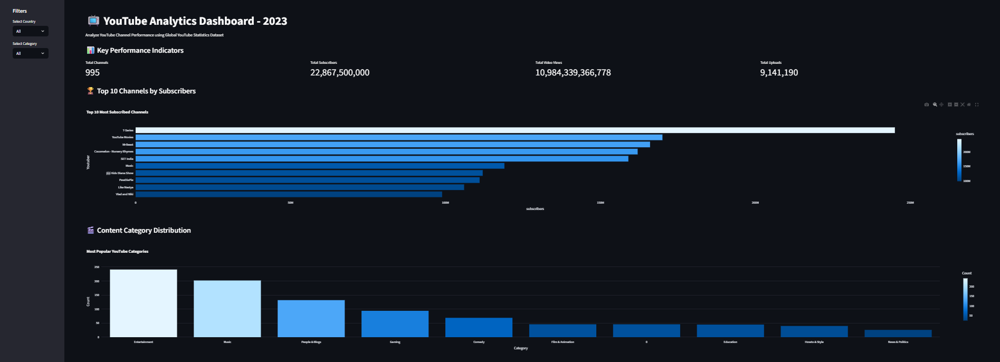
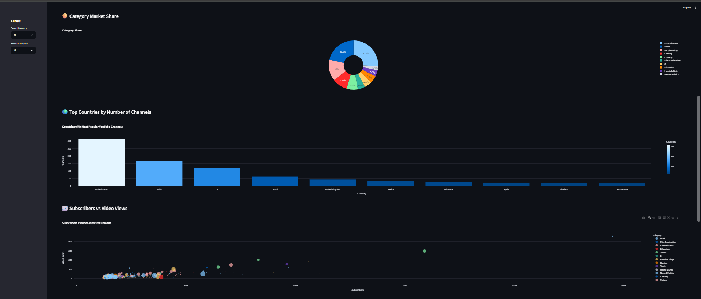
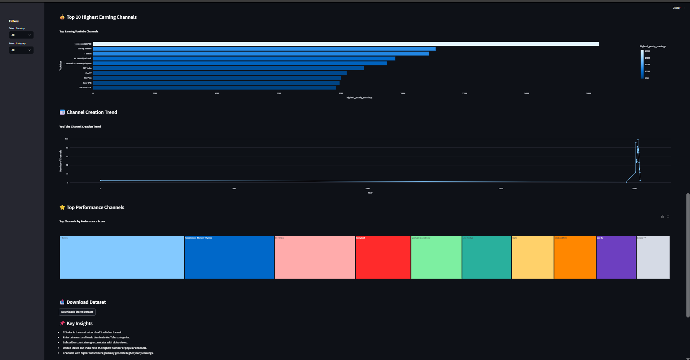

# 📺 YouTube Data - 2023 Dashboard with Streamlit

## 📌 Project Overview

This project is a YouTube Analytics Dashboard developed using Streamlit and Python. The dashboard analyzes YouTube channel statistics and provides interactive visualizations to explore key performance metrics such as subscribers, video views, uploads, earnings, channel growth, and content categories.

The project demonstrates Data Analysis, Data Visualization, and Dashboard Development skills using a real-world dataset.

---

## 🎯 Objectives

* Analyze YouTube channel performance.
* Visualize subscriber growth and video view trends.
* Explore category-wise and country-wise channel distribution.
* Identify top-performing and highest-earning channels.
* Create an interactive dashboard using Streamlit.
* Provide dynamic filtering and data exploration capabilities.

---

## 📂 Dataset

Dataset Used: **Global YouTube Statistics 2023**

Features include:

* Youtuber Name
* Subscribers
* Video Views
* Uploads
* Category
* Country
* Channel Type
* Earnings Information
* Created Year
* Population Statistics
* Geographic Information

---

## 🛠️ Technologies Used

* Python
* Pandas
* NumPy
* Streamlit
* Plotly Express
* Matplotlib
* Seaborn
* Jupyter Notebook

---

## 📊 Dashboard Features

### 📈 Key Performance Indicators (KPIs)

* Total Channels
* Total Subscribers
* Total Video Views
* Total Uploads

### 📊 Interactive Visualizations

* Top 10 Channels by Subscribers
* Content Category Distribution
* Category Market Share
* Country-wise Channel Distribution
* Subscribers vs Video Views Analysis
* Top Earning Channels
* Channel Creation Trend
* Performance Score Analysis

### 🎛️ Interactive Filters

* Country Filter
* Category Filter

### 📥 Export Feature

* Download Filtered Dataset

---

## 📷 Dashboard Preview

### Dashboard - Part 1

images/dashboard_1.png


### Dashboard - Part 2

images/dashboard_2.png


### Dashboard - Part 3

images/dashboard_3.png


---

## 📁 Project Structure

```text
Project_3_YouTube_Data_Dashboard
│
├── dashboard
│   └── app.py
│
├── data
│   └── Global YouTube Statistics.csv
│
├── images
│   ├── dashboard_1.png
│   ├── dashboard_2.png
│   └── dashboard_3.png
│
├── notebook
│   └── youtube_data_analysis.ipynb
│
├── requirements.txt
│
└── README.md
```

---

## ▶️ How to Run the Project

### Install Required Libraries

```bash
pip install -r requirements.txt
```

### Run Streamlit Dashboard

```bash
streamlit run dashboard/app.py
```

---

## 📚 Learning Outcomes

* Data Cleaning and Preprocessing
* Exploratory Data Analysis (EDA)
* Interactive Dashboard Development
* Data Visualization Techniques
* Streamlit Application Development
* Business Insights Generation

---

## 👨‍💻 Author

**Armi Sherathiya**

Data Science Internship Project – Hex Softwares
